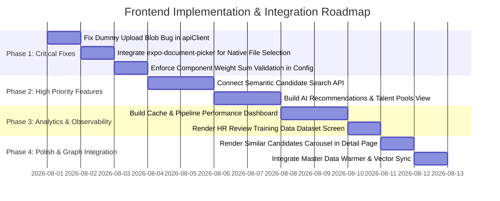

# Comprehensive Frontend Audit & Implementation Gap Analysis

## Executive Summary

A thorough, line-by-line audit of the **CV Analyzer** frontend application (`frontend/src`) was conducted across all 7 routes, 17 UI components, 6 custom hooks, 10 API service modules, state management patterns, and responsive layouts. The frontend is built using **Expo Router**, **React Native Web / NativeWind (Tailwind)**, and **Lucide Icons**.

While the primary user flows—Single CV Upload & Match, Candidate Directory, Job Vacancy List, Engine Configuration, and Batch Matching—are functional, there are **critical implementation gaps**, **unintegrated backend endpoints**, **dummy data fallbacks**, and **UX/accessibility deficiencies**.

---

## 1. Feature Status Categorization

The audit findings are categorized into 5 operational groups:
1. **Completed**: Fully implemented, styled, and integrated with backend APIs.
2. **Partial**: UI exists but lacks advanced filters, error edge cases, or full backend capabilities.
3. **Missing**: Feature exists in backend APIs or design specs but has no frontend implementation.
4. **Bug**: Runtime defects, improper fallbacks, or broken logic.
5. **Enhancement**: Recommended UI/UX, performance, or accessibility improvements.

---

## 2. Detailed Audit Findings Matrix

### A. Completed Features ✅
| Feature / Area | Route / Component | Description & Integration Status |
| :--- | :--- | :--- |
| **CV Upload & Docling Match** | `/cv-match` | Multi-step pipeline progress visualization (8 steps), file picker trigger, LLM toggle, and detailed match analysis display. |
| **Raw CV Text Evaluation** | `/cv-match` (Text tab) | Textarea input, character handling, and direct rule-based text evaluation via `/api/cv/match`. |
| **Active Job Openings** | `/vacancies` | Job listing, salary formatting in INR (LPA / absolute), experience bounds, mandatory skills badge, and search filter. |
| **Job Cache Management** | `/vacancies` | Invalidation trigger calling `/api/jobs/cache/invalidate` with inline success feedback. |
| **Batch Candidate Evaluation** | `/batch` | Candidate count limit selection (5, 10, 20, 30), execution via `/api/batch/match-candidates`, and result card rendering. |
| **Live Batch WebSocket** | `useBatchProgress.ts` | Real-time WebSocket connection to `/api/batch/ws/progress` streaming live candidate progress bars. |
| **Engine Weight Configuration** | `/config` | Threshold tuning (High/Medium), LLM boost/weights, mandatory penalties, and 8 component weight sliders/inputs calling `PUT /api/config/match`. |
| **Candidate Reprocessing** | `/candidates/[id]` | Reprocess confirmation modal, cache purging trigger calling `/api/v1/candidates/{id}/reprocess`, and status polling. |
| **HR Review Modal** | `HrReviewModal.tsx` | Score override, classification picker (HIGH/MEDIUM/LOW), feedback notes, and backend submission to `/api/match/hr-review`. |

---

### B. Partial Features ⚠️
| Feature / Area | Route / Component | Priority | Implementation Gap |
| :--- | :--- | :--- | :--- |
| **Candidate Search & Filtering** | `/candidates/index.tsx` | **HIGH** | Filtering is executed client-side on fetched items. Search inputs do not call backend's semantic candidate search API (`POST /api/v1/candidates/search`). Lacks debouncing on search text input. |
| **Candidate Profile Detail** | `/candidates/[id]` | **MEDIUM** | Displays AI Career Summary and Best Match, but ignores `similar_candidates` (vector-similar candidate profiles) returned by backend. |
| **Mobile Navigation** | `SidebarLayout.tsx` | **MEDIUM** | Mobile drawer works via bottom-right floating button, but lacks a standard top navigation header hamburger menu across page slots. |
| **Step Progress Tracker** | `StepProgressCard.tsx` | **LOW** | Single CV upload relies on HTTP polling (1.5s interval) instead of WebSocket streaming. |
| **HR Review Feedback** | `HrReviewModal.tsx` | **LOW** | Allows score overrides but doesn't display previous HR feedback history or audit trail. |

---

### C. Missing Features ❌
| Feature / Area | Backend API Target | Priority | Description of Missing Functionality |
| :--- | :--- | :--- | :--- |
| **Semantic Candidate Search** | `POST /api/v1/candidates/search` | **HIGH** | Advanced candidate search using embeddings, experience ranges, skill match ratios, and location/status filters. |
| **AI Talent Recommendations** | `GET /api/recommendations/candidate/{id}`, `vacancy/{id}`, `talent-pools` | **HIGH** | Skill gap analysis, candidate career recommendations, vacancy top matches, and internal talent pools. |
| **Cache Analytics & Telemetry Dashboard** | `GET /api/analytics/cache`, `GET /api/performance/metrics` | **MEDIUM** | Frontend `analyticsService.ts` exists but is **never rendered**. No visual dashboard for Redis hit ratios, memory usage, or pipeline stage latencies. |
| **Training Data Inspection Screen** | `GET /api/match/training-data` | **MEDIUM** | Frontend `matchService.getTrainingData()` is defined but **no UI screen** exists to review HR review dataset collected for model fine-tuning. |
| **Master Data Manager** | `GET /api/master-data/*`, `POST /api/master-data/warm` | **LOW** | `masterDataService.ts` is defined but unused. No UI to trigger cache warming or manage skills/departments/companies. |
| **Vector DB Migration & Health** | `GET /api/vector-db/status`, `POST /api/vector-db/sync` | **LOW** | No UI indicator for pgvector status or manual embedding sync trigger. |
| **Domain Knowledge Explorer** | `GET /api/domain-knowledge/*` | **LOW** | No UI for inspecting semantic equivalences (e.g. Postgres <-> PostgreSQL). |
| **Talent 360 Knowledge Graph** | `GET /api/talent-graph/*` | **LOW** | No UI visualization for Candidate/Vacancy/Skill network node graphs. |

---

### D. Bugs & Code Quality Defects 🐛
| Issue Description | Affected File & Lines | Priority | Impact |
| :--- | :--- | :--- | :--- |
| **Silent Dummy Resume File Upload** | `apiClient.ts` (L106-L111) | **CRITICAL** | If `file.rawFile` is undefined during web upload, `apiClient` silently creates a dummy text Blob (`'Candidate Resume Sample Text Content'`) and uploads it instead of raising an error. |
| **Hardcoded Native File Path** | `cv-match.tsx` (L93-L100) | **HIGH** | Non-web platforms hardcode `'file:///sample.pdf'` instead of using native `expo-document-picker`. |
| **Unsaved Weight Validation in Config** | `config.tsx` (L217-L225) | **MEDIUM** | Form shows text if weight sum != 100%, but allows user to click Save anyway, sending invalid weight proportions to backend. |
| **Dead/Duplicate Tab Bar Config** | `app-tabs.tsx` | **LOW** | Uses `expo-router/unstable-native-tabs` with static local PNG paths that conflict with `SidebarLayout`. |

---

### E. Enhancements & Accessibility (UX/a11y) 💡
| Area | Description | Priority |
| :--- | :--- | :--- |
| **Debounced Search** | Add `useDebounce` hook to candidate and vacancy search inputs to prevent API call thrashing. | **MEDIUM** |
| **Keyboard & Screen Reader ARIA** | Add `accessibilityLabel`, `accessibilityHint`, and `nativeID` to all interactive card buttons and filter pills. | **MEDIUM** |
| **Form Input Validation** | Add bounds checking for min/max CTC, experience years, and score percentages. | **MEDIUM** |
| **Dark Theme Polishing** | Standardize CSS variables for dark theme contrast in dense table rows and modal overlays. | **LOW** |

---

## 3. Actionable Implementation Roadmap

---

### Recommended Action Plan

1. **Phase 1 (Immediate Critical Fixes)**:
   - Fix `apiClient.ts` to require valid `rawFile` or File handle on web uploads, throwing explicit user errors rather than silently substituting dummy text.
   - Replace hardcoded file path in `cv-match.tsx` with `expo-document-picker` for native platform file selection.
   - Enforce 100% total weight validation in `config.tsx` before allowing submit.

2. **Phase 2 (Core Feature Completion & Integrations)**:
   - Wire `POST /api/v1/candidates/search` into `useCandidates.ts` and `candidates/index.tsx` to enable semantic candidate search with experience and department filters.
   - Add **AI Recommendations Panel** in Candidate Detail (`/candidates/[id]`) and Vacancy pages to show career transitions, skill gaps, and talent pool assignments.

3. **Phase 3 (Enterprise Dashboard & Observability)**:
   - Create a dedicated **Analytics & System Health Dashboard** route (`/analytics`) utilizing `analyticsService.ts` and `performance.py` telemetry.
   - Add **HR Training Data Manager** route (`/training-data`) to allow admins to inspect collected HR feedback examples.

4. **Phase 4 (UX & Accessibility Polish)**:
   - Render **Similar Candidates** vector matches card on candidate detail view.
   - Add `useDebounce` to all search inputs.
   - Implement accessibility roles (`accessibilityRole="button"`, `accessibilityLabel`) on all custom Pressable elements.
